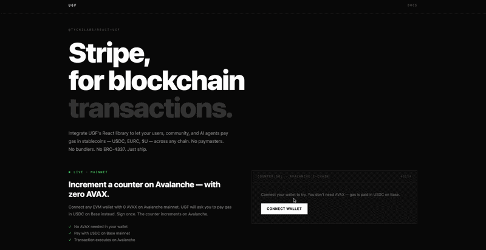
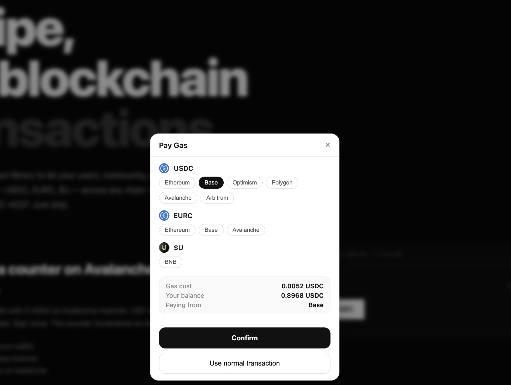

# @tychilabs/react-ugf

[](https://www.npmjs.com/package/@tychilabs/react-ugf)

> Pay gas in USDC across any EVM chain — drop-in React component powered by Universal Gas Framework

No paymasters. No bundlers. No ERC-4337. Just sign and execute.

---

## Demo



Users pay gas in USDC instead of native tokens — transaction executes on another chain without needing ETH, AVAX, or any gas token.

---

## Payment Modal (What users see)



Users choose how to pay gas — USDC across any supported chain.  
UGF handles pricing, balances, and execution automatically.

---

## How it works

1. **Trigger** — call `openUGF()` with your transaction
2. **Pay** — user selects token (USDC, etc.) and signs payment
3. **Execute** — UGF sponsors gas and executes on destination chain

Your users never need native gas tokens.

---

## Install

```bash
npm install @tychilabs/react-ugf
```

Peer dependencies:

```bash
npm install ethers
```

---

## Quick Start

### Wrap your app

```tsx
import { UGFProvider } from "@tychilabs/react-ugf";

export default function App() {
  return (
    <UGFProvider>
      <YourApp />
    </UGFProvider>
  );
}
```

---

### Use in your component

```tsx
import { useUGFModal } from "@tychilabs/react-ugf";

const { openUGF } = useUGFModal();

openUGF({
  signer,
  tx: {
    to: CONTRACT_ADDRESS,
    data,
    value: 0n,
  },
  destChainId: "43114", // Avalanche
});
```

---

## Example Flow

- User connects wallet
- Clicks action (swap / mint / send)
- Sees payment modal
- Pays gas in USDC (or supported token)
- Transaction executes on destination chain

---

## Supported

**Chains**

- Ethereum (EVM)
- Base (EVM)
- Optimism (EVM)
- Polygon (EVM)
- Avalanche (EVM)
- BNB Chain (EVM)
- Arbitrum (EVM)

---

## What UGF handles

- Payment modal (token selection + balances)
- Gas estimation and conversion
- Cross-chain execution
- Wallet chain switching
- Gas sponsorship

---

## Requirements

- EVM-compatible wallet (MetaMask, Rabby, etc.)
- ethers.js signer

---

## Demo

Live demo: [link]
Example repo: [link]

---

## API

### `openUGF`

```ts
openUGF({
  signer,
  tx,
  destChainId,
});
```

| Field       | Type                 | Description          |
| ----------- | -------------------- | -------------------- |
| signer      | `Signer`             | ethers signer        |
| tx          | `TransactionRequest` | transaction object   |
| destChainId | `string`             | destination chain ID |

---

## Compatibility

| Environment  | Status       |
| ------------ | ------------ |
| React        | Full support |
| Vite 5       | Supported    |
| Next.js      | Supported    |
| React Native | Coming soon  |

---

## Examples

See demo app for full implementation:

- Counter interaction (EVM → EVM)
- Token payment flow
- Modal UI integration

---

## About

[Tychi Labs](https://tychilabs.com) builds infrastructure for gasless and agentic Web3 execution.

`react-ugf` is the simplest way to integrate UGF into frontend apps.

Built by Yash at Tychi Labs

---

## Links

- npm: [https://www.npmjs.com/package/@tychilabs/react-ugf](https://www.npmjs.com/package/@tychilabs/react-ugf)
- GitHub: [https://github.com/TychiWallet](https://github.com/TychiWallet)
- Docs: [https://universalgasframework.com](https://universalgasframework.com)
